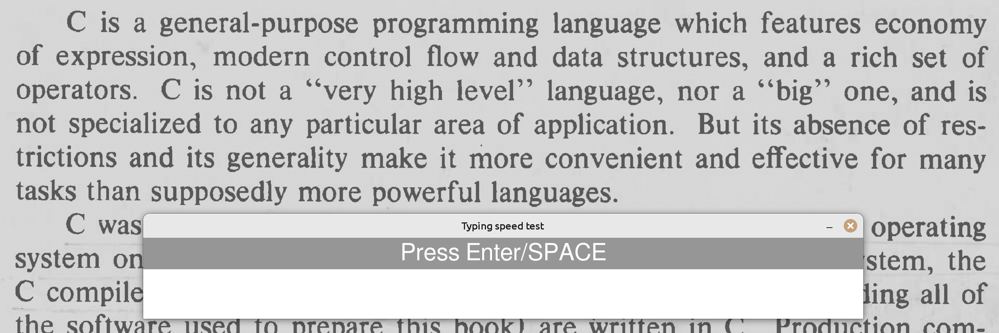
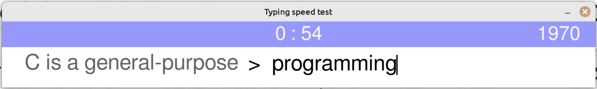
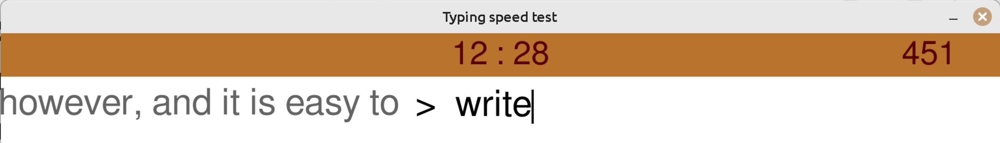
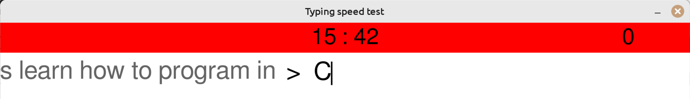

# Pygame typing speed test

- My first pet project. Helps with everyday typing training practice.
- Based on Pygame's package `textinput` example file.

## Installation

### Requirements
- Python 3.10 or higher
- Poetry

### Installation steps

Go to the directory where you want to clone the repository:
```bash
cd ~/your-repositories-directory
```

Clone the repository:
```bash
git clone https://github.com/benabub/pygame-typing-speed-test.git
```

Go to the repository directory:
```bash
cd ~/your-repositories-directory/pygame-typing-speed-test
```

Install the environment:
```bash
poetry install
```

## How to use

1. Open the text you are going to type in any application you like.
2. Start the program with `poetry run python main.py` in the package directory of the project.
3. Place the program's window ahead of the text in a middle-bottom position:

    

4. When you are ready, press a key, and the test will start.
5. You can pause the test with the PAUSE key.

## Design solution

I was inspired by one kitchen electrical grill for the design of this project.  
It has a display indicator that smoothly changes its color during cooking, depending on the time.  

That's how the result looks like: 
- Start:
    
- Half:
    
- 3/4:
    
- End:
    

## Rules

- It is assumed that you will use the touch typing method (blind typing).
- The required symbols quantity: 2000. Be ready to spend at least 15 minutes for this test. There is no pause key in this program.
- Space symbol and all the special keys (Shift, Alt, etc.) are not counted.
- All your mistypes are on your conscience. I highly recommend correcting mistakes with the BACKSPACE key, like in real typing. So don't cheat: it is the only way for you to get truthful results.
