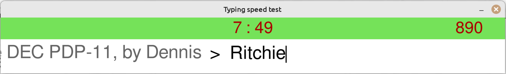

# Pygame typing speed test

My first pet project. Helps for every-day typing 
training practice. Despite it's primitive, it still can be 
useful, and contains some ideas, that will be used in my 
another project with more powerful and suitable tools 
than pygame. Based on pygame's package textinput file example. 

## How to use

1. Open text you going to type in any application you like.
2. Start the program with *$ poetry run python main.py* in 
the package directory of the project.
3. Place program's window ahead text in middle-bottom position:  

    

4. When you get ready, press key, and the test will start.

## Design solution

I was inspired by the electriсal grill Tefal for the design of this project.  
It has display indicator, that smoothly changes its color during cooking, depending on time.  
That's how the result looks like: 
- Start:
    
- Half:
    
- 3/4:
    
- End:
    

## Rules

- It is assumed that you will use the touch typing method (blind typing).
- The required symbols quantity: 2000. Be ready to spend at least 15 minutes for this test. 
There is no pause key in this program.  
- Space symbol and all the special keys (Shift, Alt, etc.) are not counted.
- All your mistypes are on your conscience. I highly recommend you to correct mistakes with the 
BACKSPACE key, like in real typing. So don't cheat: it is the only way for you to get truthful result. 
